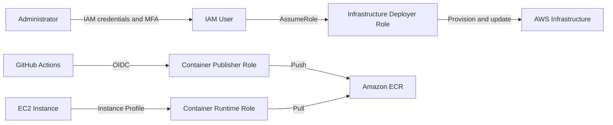

# Security View

## Identity and Access Flow

## Security Model

The project separates human access, infrastructure deployment, image publishing and runtime access.

The Administrator authenticates through a dedicated IAM User protected by MFA. Infrastructure changes are performed by assuming the Infrastructure Deployer Role.

GitHub Actions uses OIDC federation to assume the Container Publisher Role without storing permanent AWS credentials.

The EC2 instance uses an instance profile to assume the Container Runtime Role and retrieve images from Amazon ECR.

Push and pull access to ECR are separated to reduce the impact of compromised credentials.
