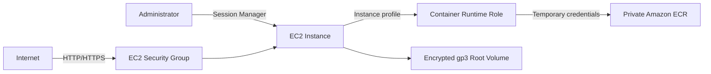

# Amazon EC2

## Purpose

Amazon EC2 provides the compute host for the portfolio deployment of the Microservices Order System.

The initial architecture intentionally uses one EC2 instance. It prioritizes a small, understandable infrastructure slice that can be created and removed through Terraform. High availability, horizontal scaling and managed load balancing are documented as production improvements rather than hidden behind the portfolio implementation.

This document describes the target architecture for the first EC2 implementation.

## Current Target Architecture

The first release consists of:

- one On-Demand EC2 instance;
- a small configurable instance type while validating EC2 provisioning;
- an encrypted gp3 root volume;
- placement in an existing subnet supplied to the module;
- existing security groups supplied to the module;
- an automatically assigned public IPv4 address when required by the temporary public-subnet design;
- the existing Container Runtime instance profile;
- access through AWS Systems Manager Session Manager;
- no Auto Scaling group;
- no load balancer; and
- no SSH key or inbound port 22.

The instance type remains configurable. A small type can validate provisioning and administration, but it will be increased after the application workload is introduced and measured.

## EC2 Module Boundary

The EC2 Terraform module is responsible for:

- resolving or accepting an AMI;
- creating one EC2 instance;
- selecting the instance type;
- attaching an existing IAM instance profile;
- attaching existing security groups;
- launching into an existing subnet;
- creating the encrypted gp3 root volume;
- enforcing Instance Metadata Service Version 2;
- applying resource tags;
- accepting optional user data for a later bootstrap step; and
- returning the instance ID, ARN, Availability Zone and IP addresses.

The module intentionally does not create:

- a VPC or subnet;
- route tables or an Internet Gateway;
- security groups;
- IAM roles or policies;
- an Auto Scaling group;
- a load balancer; or
- the software running inside the instance.

This boundary allows networking and workload bootstrap to evolve without redesigning the EC2 resource.

## Purchasing and Lifecycle Model

The instance uses the On-Demand purchasing model. 

Cost is controlled by stopping or destroying the portfolio environment when it is not being used. Starting a stopped instance introduces a short availability delay, and an automatically assigned public IPv4 address can change after a stop/start cycle.

Spot capacity is not used initially because interruption would terminate the only compute node and disrupt any stateful workloads running on it.

## IAM and Instance Profile

The EC2 service assumes the Container Runtime role through an instance profile.

The runtime role currently allows the instance to:

- authenticate to ECR;
- retrieve image manifests; and
- download image layers from the project repositories.

The instance profile does not contain permanent credentials. Host software obtains temporary credentials through the EC2 Instance Metadata Service.

Systems Manager access requires the runtime role to receive the appropriate SSM managed-instance permissions. These permissions belong to the IAM module, not the EC2 module.

## Instance Metadata Service

The module keeps IMDS enabled because host components use it to obtain instance information and temporary IAM credentials.

The security baseline is:

- IMDSv2 tokens are required;
- the response hop limit is one, limiting normal access to host processes;
- instance tags are not exposed through IMDS; and
- no AWS access keys are stored on the instance.

IAM defines what the runtime role may do. IMDS securely delivers temporary credentials representing those permissions.

## Administrative Access

AWS Systems Manager Session Manager is the intended administrative access method.

This provides:

- IAM-controlled access;
- no inbound SSH port;
- no SSH key management; and
- an auditable path for administrative sessions.

Successful Session Manager access requires:

- SSM Agent on the selected AMI;
- SSM permissions on the runtime role; and
- outbound connectivity from the instance to the Systems Manager service endpoints.

EC2 Instance Connect, direct SSH and the serial console are not part of normal administration. The serial console remains a possible recovery mechanism for low-level boot or network failures.

## Security Groups

Security groups are created outside the EC2 module and supplied as IDs.

For the first public application endpoint:

- inbound TCP 80 may allow HTTP traffic;
- inbound TCP 443 may allow HTTPS traffic;
- inbound TCP 22 is not allowed;
- the Kubernetes API, databases and messaging infrastructure must not be publicly exposed; and
- outbound traffic initially allows access to SSM, operating-system package sources and ECR.

Security groups are stateful, so response traffic for an allowed connection does not require a separate reverse-direction rule.

When a load balancer is introduced, the instance security group should accept application traffic from the load balancer security group rather than directly from the internet.

## Storage

The instance uses an encrypted gp3 root volume.

The initial volume is intentionally simple:

- configurable size;
- encryption enabled;
- baseline gp3 performance;
- deletion with the instance by default; and
- no separate persistent application-data volume in the EC2 module.

This is appropriate only while the environment is disposable. Important data must not rely solely on the root volume.

## Availability and Failure Model

The first architecture is not highly available.

If the instance stops or fails:

- the application becomes unavailable;
- no second instance can receive traffic;
- no Auto Scaling group replaces the instance;
- no load balancer redirects traffic; and
- locally stored state may require volume recovery or recreation.

These are accepted portfolio constraints and must remain explicit in the production-gap analysis.
