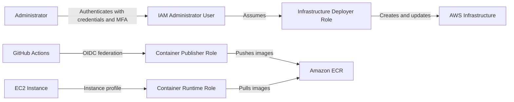

# Identity and Access Management

## Purpose

This project uses IAM identities with clearly separated responsibilities.

A dedicated IAM User represents the human administrator. Automated processes and AWS compute resources use IAM Roles with temporary credentials.

The architecture separates:

* human administration,
* infrastructure deployment,
* container image publishing,
* runtime image access.

## IAM Architecture

## Identity Overview

| Identity                | Type     | Purpose                                        |
| ----------------------- | -------- | ---------------------------------------------- |
| Administrator           | IAM User | Human access to the AWS account                |
| Infrastructure Deployer | IAM Role | Deploy infrastructure through Terraform        |
| Container Publisher     | IAM Role | Allow GitHub Actions to push images to ECR     |
| Container Runtime       | IAM Role | Allow the EC2 instance to pull images from ECR |

## Administrator IAM User

### Purpose

The Administrator IAM User is the human identity used to access the AWS account.

### Responsibilities

* inspect AWS resources,
* troubleshoot the portfolio environment,
* review deployments,
* assume the Infrastructure Deployer Role.

### Security requirements

* MFA must be enabled,
* root user must not be used for daily administration,
* no credentials may be committed to source control,
* access keys should only be created when required for local tooling,
* credentials should be rotated and removed when no longer needed.

### Permission scope

The IAM User should primarily have permission to:

* access the AWS account,
* inspect required resources,
* assume the Infrastructure Deployer Role.

Infrastructure creation and modification should be performed through the deployment role rather than directly by the user.

## Infrastructure Deployer Role

### Purpose

The Infrastructure Deployer Role is used by Terraform to create, update and remove AWS infrastructure.

### Trusted principal

The Administrator IAM User.

### Responsibilities

* provision infrastructure,
* modify infrastructure,
* destroy infrastructure when required,
* manage resources defined by the Terraform configuration.

### Restrictions

This role does not:

* build application images,
* push images to ECR as part of application CI,
* run application workloads.

## Container Publisher Role

### Purpose

The Container Publisher Role allows GitHub Actions to publish Docker images to Amazon ECR.

### Trusted principal

GitHub Actions through GitHub's OIDC provider.

### Responsibilities

* authenticate to ECR,
* push Docker images,
* read required ECR repository metadata.

### Restrictions

This role cannot:

* modify infrastructure,
* assume the Terraform deployment role,
* manage EC2 resources,
* administer IAM,
* delete unrelated ECR repositories.

The trust policy should restrict access to the approved GitHub repository and, where applicable, the approved branch or GitHub environment.

## Container Runtime Role

### Purpose

The Container Runtime Role allows the EC2 instance to retrieve application images from Amazon ECR.

### Trusted principal

The EC2 service.

The role is attached to the instance through an EC2 instance profile.

### Responsibilities

* authenticate to ECR,
* retrieve image manifests,
* download container image layers.

### Restrictions

This role cannot:

* push images,
* delete images,
* modify ECR repositories,
* deploy infrastructure,
* manage IAM resources.

## Credential Model

The architecture uses different credential models for human and automated access.

### Human access

The Administrator authenticates as an IAM User with MFA.

### Terraform access

Terraform uses temporary credentials obtained by assuming the Infrastructure Deployer Role.

### GitHub Actions access

GitHub Actions uses OIDC federation to obtain temporary AWS credentials.

No permanent AWS access keys are stored in GitHub Secrets.

### EC2 access

The EC2 instance receives temporary credentials through its instance profile.

No AWS access keys are stored on the instance.

## Security Principles

* Root credentials are not used for daily work.
* MFA is enabled for the Administrator IAM User.
* Automated systems use IAM Roles.
* GitHub Actions uses OIDC instead of permanent access keys.
* EC2 uses an instance profile instead of stored credentials.
* Image publishing and image pulling use separate permissions.
* Infrastructure deployment is separated from human identity.
* Permissions are scoped to project resources where practical.

## Current Limitations

* The project uses one AWS account.
* The Administrator is represented by an IAM User instead of IAM Identity Center.
* The Infrastructure Deployer Role may initially require broad permissions.
* There is no separate read-only operator identity.
* Applications do not yet have workload-specific IAM roles.

## Future Improvements

* Migrate human access to IAM Identity Center.
* Reduce the Infrastructure Deployer Role to resource-specific permissions.
* Add a read-only operations role.
* Add workload-specific roles when applications require AWS services.
* Introduce permission boundaries where delegated role creation is needed.
* Validate trust and permission policies with IAM Access Analyzer.
